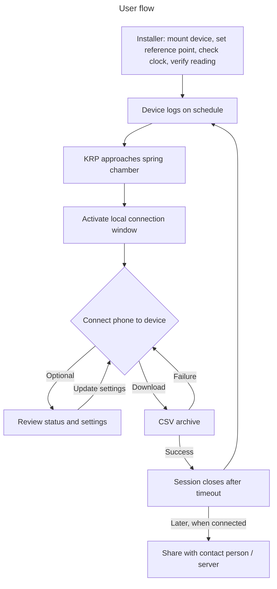
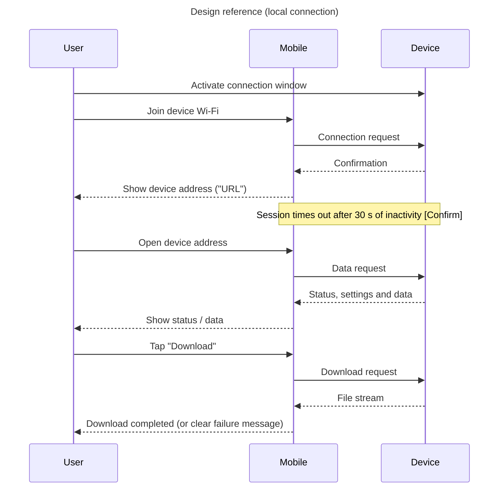

# Spring Water-Level Logger

## Product Requirements Document

**Status:** For stakeholder review. Items marked **[Confirm]** are assumptions, and values marked **proposed** are targets not yet agreed. Both need stakeholder sign-off before design freeze.
**Long-term objective:** Support reliable spring-discharge monitoring.
**MVP deliverable:** One working, locally accessible water-level logger installed at one agreed spring site within 30 days of project start.

---

## 1. Background and Problem

Himalayan springs provide fresh water for a large share of people in India **roughly 1 in 7;** Spring discharge, usually measured in litres per minute (LPM), is a key indicator of spring health. Climate change and human interventions are reducing discharge, making springs seasonal, and drying some up completely. Reliable data is essential for assessing spring health and designing recharge measures.

| Dimension | Description |
|---|---|
| **Who** | Field researchers, hydrologists, water resource managers and community resource persons monitoring Himalayan springs |
| **What** | Measuring spring behaviour is a slow, manual process |
| **Where** | Remote, high-altitude spring chambers |
| **When** | Only during field visits, which are limited by weather and access |
| **Why it matters** | Manual methods vary between operators, produce coarse low-frequency data and leave gaps when visits are disrupted. This limits the reliability of spring health assessments |
| **Current method** | Stopwatch, 1-litre container and measuring scale, operated by on-site personnel |

The product should automatically record water level at remote spring chambers, store the records locally, and let a field worker retrieve them from a phone without internet access and without opening the electronics enclosure.

Water level (millimetres) is not discharge (LPM). Converting level to discharge needs site-specific measurements to derive LPM. That can be calcuated on post data analysis.

---

## 2. Users and Current Workflow

| User | Need |
|---|---|
| **Primary: Key Resource Person (KRP) of the Water User Community** | Retrieve reliable records with little training, without disrupting water collection |
| Hydrologist / researcher | Time-stamped measurements with clear units, a stable reference point and visible data-quality flags |
| Water resource manager | Comparable records from identified sites for later review and planning |
| Installer / maintainer | Install, check, calibrate and service the device using a documented procedure |

**Field example:** Kajal Mandral, KRP of the Water User Community, follows this workflow:

1. Place a measuring scale vertically in the spring chamber, zero aligned with the chamber base, and record the initial water level.
2. Remove 5 litres using a 1-litre container (5 scoops).
3. An assistant starts a stopwatch at the first scoop and stops it when the level returns to the recorded mark.
4. Discharge is estimated from the recovery time.

This is the existing workflow. A hydrologist must review withdrawal timing, chamber storage, inflow, outflow, leakage and concurrent water collection before recovery time is used to infer discharge. Four scheduled level readings per day will not by themselves capture this recovery process.

**Target workflow:** The device logs water level automatically at set intervals. The KRP visits, connects wirelessly, reviews status, downloads the archive, and shares it with the programme contact person.

---

## 3. Goals and Success Measures

| Goal | Baseline | Target | Evidence |
|---|---|---|---|
| Increase recording frequency | 4 readings/month | ≥ 4 scheduled readings/day (about 6 hours apart) | Configured schedule vs recorded timestamps |
| Improve measurement accuracy | Manual error not yet measured  | **Proposed:** absolute water-level error ≤ 5 mm within the agreed range and conditions; repeatability (standard deviation)| Comparison with an independent reference: report bias, maximum absolute error and repeatability |
| Data completeness | n/a | **Proposed:** 100% of scheduled readings in the 7-day controlled run; ≥ 95% valid readings over the supervised pilot | Scheduled vs valid records |
| Retain records locally | n/a | ≥ 3 calendar months at the maximum supported logging rate | Capacity calculation plus storage and retrieval test |
| Operate without mains power | n/a | **Proposed:** ≥ 90 days between battery service (solar optional) | Measured energy budget; field runtime evidence |
| Practical retrieval | Not available | **Proposed:** three representative users each download the archive offline within 5 minutes of approaching the device, after brief instruction and without help; the transfer itself completes in < 2 minutes  | Observed task completion and archive checks |
| Deliver a pilot | n/a | One installed prototype within 30 days, subject to component availability and site access | Installation record and pilot acceptance checklist |
| Control cost | n/a | ≤ ₹10,000 per installed unit, with the cost boundary agreed before purchasing | Itemised cost sheet |
| Server upload over mobile network | Not available | **Next phase** (out of scope for this release) | n/a |

**Frequency calculation:** On a 30-day-month basis, 4 readings/day is about 120 readings/month. Compared with 4 readings/month this is a 30× increase, or **+2,900%**.

**Accuracy wording:** "Standard deviation of ±3 mm" mixes two measures. The proposed ±3 mm is an error limit against a reference. Standard deviation describes repeatability and is reported separately as a non-negative value.

---

## 4. Scope

### Included in the MVP

- Scheduled water-level measurement and time-stamped local storage
- Operation without mains power, with a defined maintenance interval
- Offline archive download to a compatible phone without opening the enclosure
- Basic device status, clock setup, calibration reference and logging configuration
- Mounting, environmental protection, installation instructions and maintenance guidance
- One prototype and a supervised field pilot

### Excluded from the MVP

- Automatic cellular upload, cloud dashboards, remote alerts and remote control
- Discharge estimation in LPM until a site-specific method
- Automated water withdrawal or pumping for recovery tests
- Advanced analytics, multi-site rollout, and claims of three-month or seasonal field validation within the 30-day build

A field worker may manually share a downloaded archive later. This is separate from automatic device-to-server transmission.

### Constraints

- Cost ≤ ₹10,000 per unit (boundary to be defined, see Section 10)
- Weight < 3 kg; dimensions to be set after the site survey (see PR-08)

---

## 5. Product Requirements and Acceptance Criteria

Acceptance tests are proposed verification plans. Resolve the dependencies in Section 10 before declaring the affected requirements passed.

| ID | Requirement | Priority | Acceptance criterion |
|---|---|---|---|
| PR-01 | Record water level automatically at least 4 times per day at a configurable interval | Must | In a 7-day controlled run at the default schedule, all 28 scheduled readings are retained with unique record IDs and valid timestamps. Any missed reading counts as a failure |
| PR-02 | Measure relative to a documented, fixed reference point | Must | At five levels spanning the agreed range, take ten readings per level against a reference of known, finer accuracy. Apply the agreed error limit (proposed ≤ 5 mm), report repeatability separately, and repeat under the agreed environmental conditions |
| PR-03 | Operate without mains power | Must | Provide a measured energy budget covering sensing, idle, storage and downloads. Demonstrate operation for the agreed service interval (proposed ≥ 90 days). Until then, label runtime as *projected* |
| PR-04 | Store at least 3 calendar months of data | Must | Provision ≥ 93 days at the maximum supported logging rate, including status records. Load representative records, restart the device and recover them without loss or corruption. At 4 readings/day this is ≥ 372 measurement records |
| PR-05 | Allow offline, contactless archive retrieval | Must | A supported phone downloads a complete CSV without mobile data, site internet or opening the enclosure. Exported record IDs and values match the stored archive. Meets the retrieval targets in Section 3 |
| PR-06 | Preserve records through interruptions | Must | A failed download does not delete source data. A power interruption does not corrupt previously committed records. After restart, logging resumes and the restart or clock fault is recorded |
| PR-07 | Preserve normal community water access | Must | At the chosen site, users carry out their normal water-collection tasks without obstruction, device handling or unsafe exposed parts. Placement does not contaminate the water or alter the measurement conditions |
| PR-08 | Support practical transport and installation | Should | Total installed mass < 3 kg, with included components listed. One person installs it with basic tools in < 30 minutes using the documented procedure (**proposed**). Maximum length × width × height is set after the site survey (see note below) |
| PR-09 | Withstand the site environment | Must | Record temperature, humidity, splash/rain, condensation and possible immersion at the site. Test the complete assembly, including cable entries, against those conditions. Proposed target: IP67 or better, or as decided in the concept study. Any claimed IP rating needs supporting evidence |
| PR-10 | Maintain usable time and calibration records | Must | Timestamps carry an explicit UTC offset. The clock survives routine restart or time is flagged invalid. Verify the agreed clock-drift limit (**proposed:** ≤ 1 min/month) and track changes to time, reference and calibration. Time can be set or synced during a visit |
| PR-11 | Expose status and handle invalid readings clearly | Must | Locally show device identity, last sample, power status and storage status. In a simulated sensor failure, preserve a flagged record and never substitute zero for a missing value |
| PR-12 | Control configuration and archive retention | Must | Routine downloads cannot change settings or delete records. Confirm access controls, log configuration changes, and demonstrate the agreed full-storage behaviour. Never silently discard records within the retention window |
| PR-13 | Meet the installed-unit cost ceiling | Must | An itemised cost sheet totals ≤ ₹10,000 under the approved cost boundary, including sensor, controller, power system, enclosure, storage, mounting, assembly and installation |

**Physical size:** The product should not exceed 300 cm³ and should not cause any obstruction for the local communities fetching water from the chamber opening.

---

## 6. Data and Measurement Rules

The downloadable CSV must have a documented schema and include:

| Field | Purpose |
|---|---|
| `device_id`, `site_id` | Identify the source device and spring |
| `record_id` | Identify each scheduled sample and help detect duplicate exports |
| `timestamp` | ISO 8601 time with UTC offset |
| `water_level_mm` | Level relative to the documented reference; blank when invalid |
| `quality_flag` | Valid measurement, sensor error, out-of-range reading or unverified time |
| `temperature_c` (optional) | Supports temperature compensation and checks, if a temperature sensor is fitted |
| `battery_voltage_v` or equivalent power metric | Supports power and maintenance checks |
| `calibration_version`, `configuration_version` | Link readings to the setup that produced them |

Keep a separate device/site record for installation position, reference definition, sensor range, firmware version, calibration checks and service history. Do not include a `discharge_lpm` field until a validated conversion and its applicable range exist.

Downloading must not erase records. Retention beyond three months and the full-storage policy must be documented. New settings apply prospectively; historical records are never silently rewritten.

---

## 7. User Flow and Design References

### User flow

### Design reference

The connection method, supported phone platform, wake mechanism and timeout remain design decisions. If Wi-Fi and a browser page are chosen, instructions must explain how to join the device network and open its local address. Do not assume the phone has internet while connected to the device. A failed or interrupted download leaves source records intact, and the worker can reconnect and retry.

---

## 8. Assumptions, Risks and Open Questions

### Assumptions

- Chamber geometry is known and stable 
- Level-change behaviour is repeatable enough to support later analysis, subject to hydrologist review

### Risks and mitigations

| Risk | Response |
|---|---|
| Temperature, condensation, turbulence, fouling or mounting movement affects readings | Define operating conditions; log temperature alongside level where possible; test across the expected range; specify cleaning and reference-check procedures |
| Water collection changes chamber level | Document site usage and measurement context; do not treat every level change as a change in discharge |
| Power exhausted before next visit, including cold-weather battery loss or snow blocking solar | Measure consumption; size for worst-case winter; agree the service interval; provide a power-status check |
| Animals, accidental contact or tampering | Concealed or secured mounting and a robust enclosure; inspect during the pilot |
| Moisture, sediment or biofouling | IP-rated enclosure; sensor type tolerant of dirty water |
| Clock reset or storage failure makes records unusable | RTC with backup; sync at every visit; preserve committed data; flag faults; test restart and full-storage behaviour |
| Wireless access unreliable at the installed position | Test representative phones at the actual mounting location |
| Cost or procurement exceeds the 30-day plan | Review the costed concept before purchasing; explicitly revise scope or schedule when needed |

Temperature insensitivity and freedom from animal or human damage are not assumed.

---

## 9. Delivery and Pilot Plan

| Period | Activity | Exit criterion |
|---|---|---|
| Days 1–5 | Interview the KRP and other resource persons; inspect the site; resolve measurement scope | Agreed water-level MVP, operating range, service interval, cost boundary and test plan |
| Days 6–10 | Compare sensing, power and data-access concepts; prepare cost and power budgets | Feasible concept selected; key components available; mounting and local-access approach agreed |
| Days 11–17 | Assemble the prototype; implement logging, archive retrieval and fault handling | Bench functions work; initial measurement and storage checks pass |
| Days 18–24 | Run the 7-day logging test, usability checks and interruption tests (power loss, connection failure) with a hydrologist | Results documented; critical failures corrected or deployment delayed |
| Days 25–30 | Install at the approved site; begin a supervised pilot | Installation check, reference comparison, successful field download and handover completed |
| After deployment | Continue monitoring through the agreed service interval and the three-month retention period | Actual runtime, record completeness, environmental performance and maintenance findings documented |

**Pilot measures:** scheduled vs valid records; missing or duplicate records; measurement error vs reference; successful download attempts and duration; power consumption; maintenance interventions; and reported interference with water collection. A fault record documents an attempted sample but does not count as a valid reading. A one-site pilot does not establish suitability across all Himalayan sites.

**Next phase:** server upload over the mobile network.

---

## 10. Decisions Required Before Design Freeze

| Decision | Proposed owner |
|---|---|
| Is water-level logging sufficient for the MVP, or is automatic discharge in LPM essential? | Product owner and hydrologist |
| What level range, reference point, environmental conditions and ±5 mm interpretation apply? | Hydrologist and engineering lead |
| Are four daily readings enough for the intended analysis? Is a separate rapid-sampling recovery mode needed? | Hydrologist and field team |
| How long must the device run between power servicing, and is solar practical? | Engineering lead and field team |
| Which phones, connection method, access controls and session timeout are supported? | Product owner and engineering lead |
| What are the allowable dimensions and mounting location? | Field team and community representative |
| What clock drift, archive policy and maintenance interval are acceptable? | Research and engineering leads |
| What is the current manual measurement error baseline, and how will it be measured? | Hydrologist and field team |
| Does ₹10,000 cover taxes, transport, travel, prototype development and recurring maintenance, or only installed-unit production cost? | Project sponsor |
| Who approves the pilot site, acceptance results and deployment? | Project sponsor and field lead |

---
