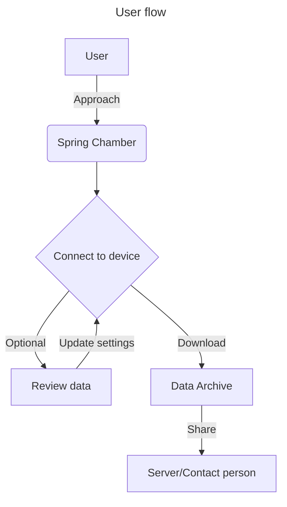

# Water Discharge logger

## Introductions

Himalayan springs provide fresh water for 1 in 7 people in India. Spring discharge is one of the crucial parameters that determines the health of a spring and is usually measured in litres per minute (LPM). Due to changing climatic conditions and human interventions, natural springs are experiencing declining discharge, becoming seasonal, and in some cases drying up completely, contributing to a water crisis in India. Measuring spring discharge is vital for assessing spring health and for designing effective recharge measures.


## Problem statement

Measuring spring water discharge is time consuming process, with manual human methods the data is prone to human error, coarse data frequency and sometimes the climatic conditions may not favor collecting data.

- Who: Field researchers, hydrologists, and water resource managers monitoring Himalayan springs
- What: Measuring spring water discharge is a time-consuming, manual process
- Where: Remote, high-altitude spring sites in the Himalayas
-  When: During field visits, often constrained by weather and accessibility
- Why it matters: Manual methods introduce human error, produce coarse (low-frequency) data, and are frequently disrupted by unfavourable climatic conditions—limiting the accuracy and reliability of spring health assessments
- How it’s currently done: Using stopwatches, buckets, and Measuring scales operated by personnel on-site.
      
## Goals and success metrics
- Increasing the data collection frequency by 2000% ( 4 Reading per month → 4 Readings per day ).
- Reducing the unpredictable error to standard deviations of ±5mm.
- Pushing data directly to server via mobile network connectivity. ( Next phase )


## Users and use cases

Kajal Mandral (KRP – Water User Community) typically uses a standard 1-litre container at the spring origin. She first records the initial water level by placing a measuring scale inside the spring chamber, aligning the scale’s zero mark with the base and holding it vertically. She then removes 5 litres of water from the chamber using the container. An assistant starts a stopwatch as soon as the first scoop of water is taken and stops the timer when the water level returns to the initially recorded mark. The time taken for the water level to recover to its original point is then used to calculate the spring’s discharge rate.

## Product Requirements


   
| ID    | Requirement                                                        | Priority         | Acceptance method                                                                                              |
| ----- | ------------------------------------------------------------------ | ---------------- | -------------------------------------------------------------------------------------------------------------- |
| PR-01 | Support a repeatable water level measuring at least 4 times a day. | Must have        | Physical prototype/mockup proving at least 4 recording continuously for a day.                                 |
| PR-02 | Proposed hardware supports remote area with no power connectivity  | Must have        | Power backup/ uninterrupted power supply conditions.                                                           |
| PR-03 | Device should hold up to 3 months of water level data.             | Must have        | Data format must have timestamp & Water level readings.                                                        |
| PR-04 | Should support easy access of archived data to review.             | Must<br><br>have | Preferable contact less data transfer to preserve the integrity of the device for long term and accessibility. |
| PR-05 | Adds no friction for the local communities in fetching water       | Should have      | Compact size ( < 300m3 )                                                                                       |
| PR-06 | Easy installation setup in rural areas                             | Should have      | Weight ( < 3kg )                                                                                               |
| PR-07 | Supports moist environment conditions                              | Nice to have     | IP ratings of the device.            


## Scope and constraints:
Included : Water level logger, 3 Months data storage, Works on remote no power supply zones, easy installation, easy data reading, Low on maintenance.

Excluded: Direct data transfer to the server, data analysis, Real time interactions.

Constraints: Entire device should not exceed 10,000Rs including manufacturing & installation cost.

## User flow and design references:




 ```mermaid
---
title: Design reference
---
sequenceDiagram
    participant U as User
    participant App as Mobile
    participant Dev as Device
    U->>App: Tap "Connect"
    App->>Dev: Connection request
    Dev-->>App: Confirmation
    App-->>U: Show "URL"
    Note over App,Dev: Timeout after 30s
    U->>App: Open "URL"
    App->>Dev: Data Request
    Dev-->>App: Data confirmation
    App-->>U: Show settings/data
    U->>App: Tap "Download"
    App->>Dev: Download Request
    Dev-->>App: Confirmed
    App-->>U: Download completed

 ```

## Assumptions, risks, and open questions:

- Assuming the tempearature in the surrounding regions uneffect the reading of the device.
- No Possible damage on device by local communities/ animals.

## Timeline and milestones:


| Stage | Activity | Exit criterion |
|---|---|---|
| Discovery | Interview the KRP and other resource persons on fetching water measures records | Supported problem statement, baseline measurement plan, and agreed user/test envelope. |
| Concept study | Compare workflow, ground-equipment; review device requriemnts, cost, usability, and safety implications. | One or two feasible concepts selected for mock-up testing, with agreed budgets. |
| Mock-up evaluation | Run a proposed minimum standard-condition exchanges across hydro-geologist,reporting exception scenarios. | Reproducible timings, task errors, assistance needs, and unresolved findings documented. |
| Review | Compare outcomes with the draft targets and sensitivity-test | Proceed, revise, or stop decision supported by evidence. |


## Rollout and measurement plan:

Expecting one working prototype should be build and deployed in 30 days including the above satges.
